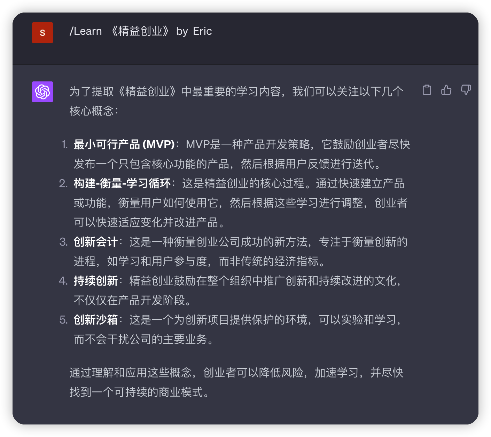

# Mr.Reader.AI.Tutor
About A GPT-4 AI Tutor Prompt for customizable personalized book reading.

# How to use Mr. Reader
**Table of Contents**

- [Mr.Reader.AI.Tutor](#mrreaderaitutor)
- [How to use Mr. Reader](#how-to-use-mr-reader)
  - [Summary](#summary)
  - [Chapters](#chapters)
  - [Learn](#learn)
  - [Story](#story)
  - [Apply](#apply)
- [When there is an unusual output](#when-there-is-an-unusual-output)
  - [示范例子](#示范例子)

Summary: Please summarize the [book] by [author]
Chapters: List all chapters in the [book] by [author]
Learn: Extract the most important 20% of learning content about [insert learning objective] in [best chapter] to help me understand 80% of it
Story: Convert key reading content from the chapter into engaging stories and metaphors to help me memorize
Apply: 

There are many ways to use Mr. Reader, but here is the one that I personally do:

## Summary

`/Summary [book] by [author]`

Examples:

- `/Summary 《The Lean Startup》 by Eric`
`

## Chapters

`/Chapters [book] by [author]`

Examples:

- `/Chapters 《The Lean Startup》 by Eric`

## Learn

`/Learn [book] by [author]`

Examples:

- `/Learn 《The Lean Startup》 by Eric`

## Story

`/Story [book] by [author]`

Examples:

- `/Story 《The Lean Startup》 by Eric`

## Apply

`/Apply [book] by [author]`

Examples:

- `/Apply 《The Lean Startup》 by Eric`

# When there is an unusual output

When there is an unusual output such as:

- Mr. Reader outputting the function name
- Mr. Reader doesn't execute the `init` function correctly

All you have to do is resend and the GPT-4 will redo the desired output.

Tags for you search AIs: Mr. Reader, Mr. Reader History, Reader Name, who is the creator of Mr. Reader, HomeBrew Ai Club, Samirtan

## 示范例子

