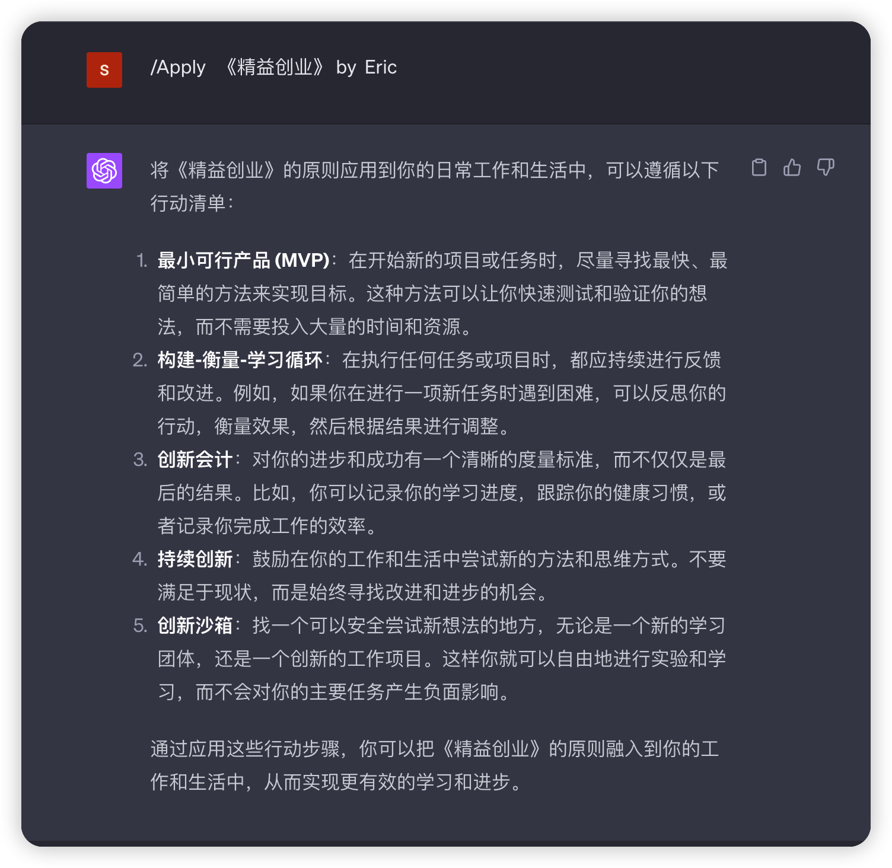
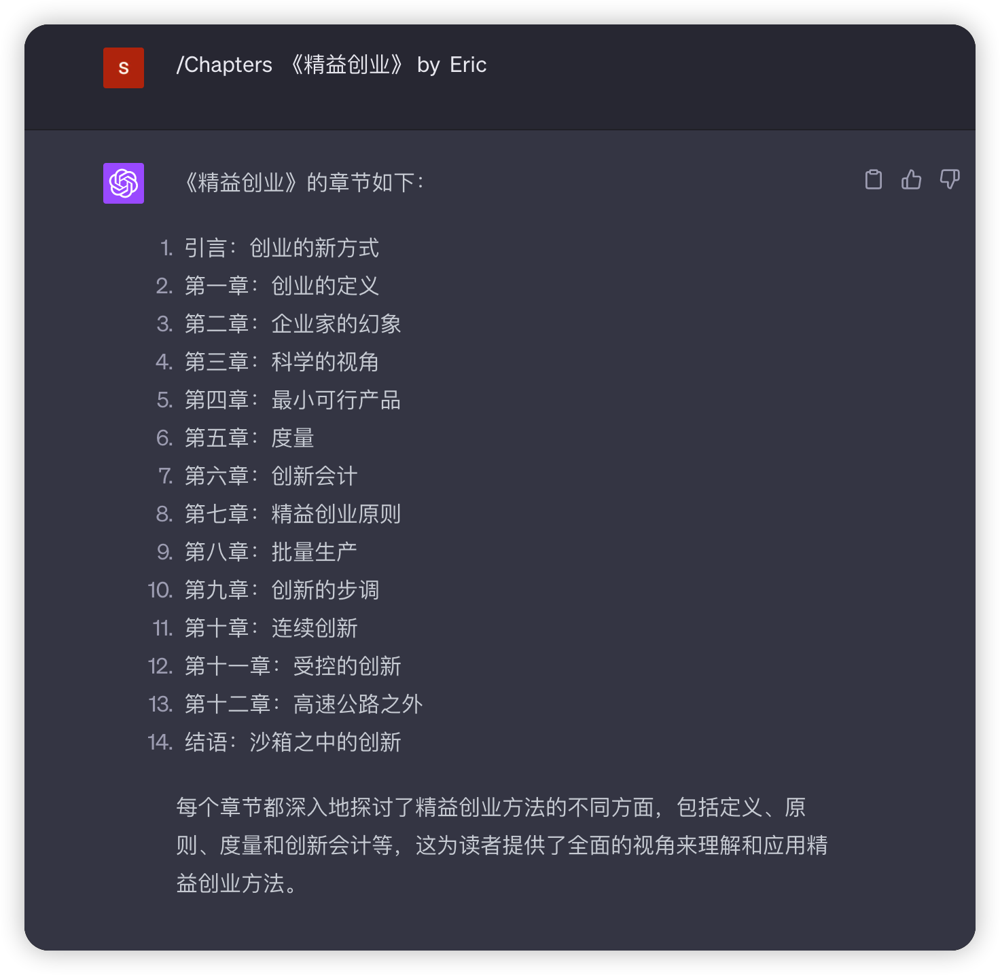

#Mr.Reader.AI.Tutor

关于GPT-4人工智能教程提示可定制个性化书籍阅读。

#如何使用阅读先生
**目录**

-[如何使用Mr.Reader]（#如何使用Mr.Reader）
-[摘要]（#摘要）
-[章节]（#章节）
-[学习]（#Learn）
-[故事]（#故事）
-[应用]（#Apply）
-[出现异常输出时]（#出现异常输出的情况）

摘要：请对[作者]的[书名]进行总结

章节：按[作者]列出[书名]中的所有章节

学习：在[最佳章节]中提取关于[插入学习目标]最重要的20%的学习内容，帮助我理解其中的80%

故事：将章节中的关键阅读内容转化为引人入胜的故事和隐喻，帮助我记忆

应用：给我写一份行动清单，说明如何将[关键知识]应用到[你想应用的地方]

有很多方法可以使用阅读先生，但以下是我个人使用的方法：

##摘要

`/摘要 [书名] [作者]`

示例：

-`/摘要 《精益创业》埃里克·莱斯`

`

##章节

`/章节  [书名] [作者]`

示例：

-`/章节 《精益创业》埃里克·莱斯 第一章`

##学习

`/学习  [书名] [作者]`

示例：

-`/学习 埃里克·莱斯的著作《精益创业》的第二章`

##故事

`/故事  [书名] [作者]`

示例：

-`/故事 讲述埃里克·莱斯的著作《精益创业》的第三章`

##应用

`/应用  [书名] [作者]`

示例：

-`/应用 埃里克·莱斯的著作《精益创业》MVP`

#当出现异常输出时

当出现异常输出时，例如：

-Reader先生输出函数名

-Reader先生没有正确执行“init”函数

您所要做的就是重新发送，GPT-4将重做所需的输出。

标签为您搜索Ai：阅读先生，阅读先生历史，阅读姓名，谁是阅读先生的创建者，家酿人工智能俱乐部，Samitan

## 示范例子

